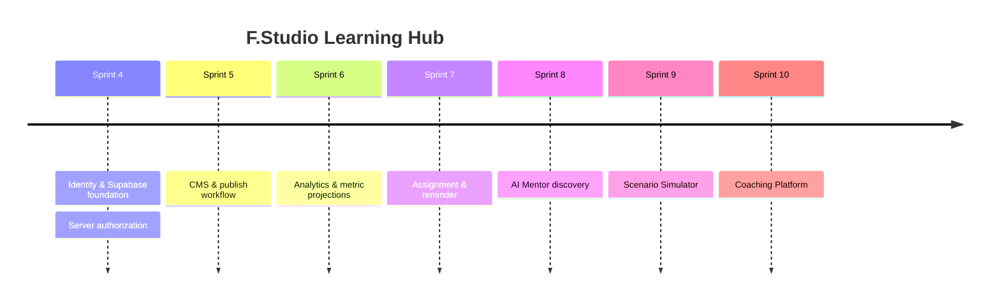

# Product Vision

[← Mục lục](./README.md)

## Mục lục

- [Tầm nhìn](#tầm-nhìn)
- [Vấn đề](#vấn-đề-cần-giải-quyết)
- [Đối tượng](#đối-tượng-sử-dụng)
- [Giá trị](#giá-trị-mang-lại)
- [KPI](#kpi-thành-công)
- [Nguyên tắc](#nguyên-tắc-phát-triển)
- [Roadmap](#roadmap-tổng-thể)

## Tầm nhìn

Trở thành hệ điều hành đào tạo bán lẻ của F.Studio: đưa đúng kiến thức đến đúng nhân viên vào đúng thời điểm, biến dữ liệu học tập thành hành động coaching có thể đo lường.

## Vấn đề cần giải quyết

- Kiến thức sản phẩm và chiến dịch thay đổi nhanh, phân phối không đồng đều.
- Nhân viên khó biết nội dung nào cần học tiếp trong thời gian ca làm hạn chế.
- Trainer thiếu workflow thống nhất để soạn, duyệt, publish và cập nhật nội dung.
- Quản lý cửa hàng thiếu tín hiệu sớm về nhân viên cần hỗ trợ.
- Kết quả quiz đơn lẻ chưa giải thích được lesson, store hoặc region yếu.

## Đối tượng sử dụng

| Persona | Nhu cầu chính | Phạm vi |
| --- | --- | --- |
| Employee | Học nhanh, tiếp tục đúng chỗ, xem kết quả | Self |
| Trainer | Xây nội dung, publish, phân tích | Brand/category được cấp |
| Store Manager | Theo dõi đội ngũ, nhắc học | Store được cấp |
| Super Admin | Tổ chức, quyền, taxonomy, governance | Global/brand |

## Giá trị mang lại

- Employee: rõ “đang học gì, còn bao nhiêu, học tiếp ở đâu”.
- Trainer: giảm thời gian vận hành nội dung, tăng khả năng truy vết chất lượng.
- Store Manager: can thiệp sớm dựa trên dữ liệu, không dùng leaderboard gây áp lực.
- Doanh nghiệp: chuẩn hóa kiến thức, đo readiness theo chiến dịch và khu vực.

## KPI thành công

| Nhóm | KPI | Định nghĩa sơ bộ |
| --- | --- | --- |
| Adoption | Weekly active learners | Employee có learning event trong 7 ngày |
| Completion | On-time completion rate | Assignment hoàn thành trước deadline / đến hạn |
| Quality | First-attempt pass rate | Attempt đầu đạt / người submit lần đầu |
| Effectiveness | Remediation recovery | Fail rồi pass trong 14 ngày |
| Content ops | Publish lead time | Draft đầu đến published |
| Engagement | Continue Learning conversion | Click CTA và mở lesson/quiz |
| Coverage | Campaign readiness | Employee bắt buộc đã hoàn thành trước launch |

Mục tiêu số phải được baseline trong Sprint 6; không đặt target thiếu dữ liệu lịch sử.

## Nguyên tắc phát triển

1. Next action luôn rõ.
2. Mobile và ca làm là ngữ cảnh mặc định.
3. Published content bất biến và có version.
4. Privacy by default; manager chỉ thấy đúng scope.
5. Analytics phải giải thích được.
6. Accessibility và keyboard là acceptance criteria.
7. Không gamification gây áp lực hoặc xếp hạng cá nhân công khai.
8. AI chỉ hỗ trợ, không thay quyền quyết định của Trainer.

## Roadmap tổng thể

## Tài liệu liên quan

[Future Roadmap](./11-future-roadmap.md) · [Analytics Design](./09-analytics-design.md) · [Risk Assessment](./12-risk-assessment.md)

