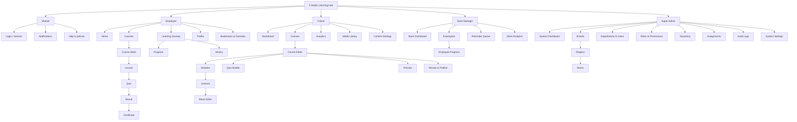

# Information Architecture

[← Mục lục](./README.md)

## Mục lục

- [Sitemap](#sitemap)
- [Navigation model](#navigation-model)
- [IA rules](#ia-rules)
- [Tài liệu liên quan](#tài-liệu-liên-quan)

## Sitemap

## Navigation model

| Role | Primary navigation | Contextual navigation |
| --- | --- | --- |
| Employee | Home, Courses, Journey, Profile | Lesson outline, quiz questions |
| Trainer | Dashboard, Courses, Analytics, Media | Editor outline, inspector, publish actions |
| Store Manager | Dashboard, Employees, Reminders, Analytics | Employee/course drill-down |
| Super Admin | Organization, Access, Assignments, Audit, Settings | Brand/region/store hierarchy |

## IA rules

- Một URL đại diện một resource hoặc task có thể bookmark.
- Editor state không trộn vào global navigation.
- Store Manager không thấy CMS actions.
- Super Admin configuration tách khỏi Trainer content operations.
- Search toàn cục trả kết quả theo quyền và scope.
- Mobile ưu tiên 4 destinations; actions thứ cấp nằm trong menu tài khoản.

## Tài liệu liên quan

[User Flows](./03-user-flows.md) · [Permission Matrix](./06-permission-matrix.md) · [CMS Blueprint](./07-cms-blueprint.md)
