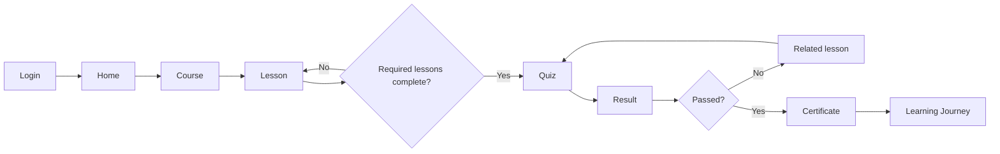
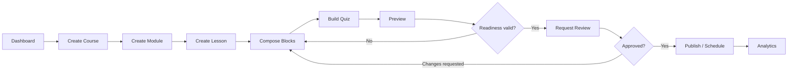
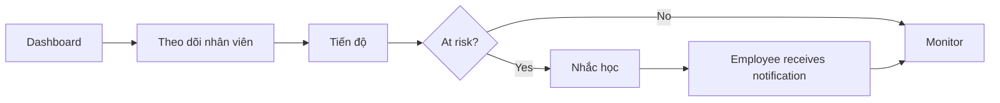
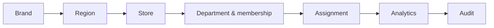
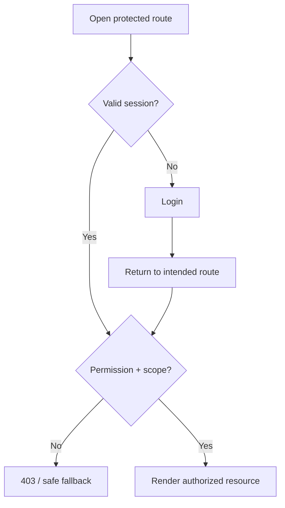

# User Flows

[← Mục lục](./README.md)

## Mục lục

- [Employee](#employee)
- [Trainer](#trainer)
- [Store Manager](#store-manager)
- [Super Admin](#super-admin)
- [Session and authorization](#session-and-authorization)
- [Tài liệu liên quan](#tài-liệu-liên-quan)

## Employee

Exception flows: expired assignment remains visible but flagged; revoked course becomes read-only history; interrupted quiz resumes draft unless course version changed.

## Trainer

## Store Manager

Manager không sửa progress, submit quiz thay nhân viên hoặc xem dữ liệu ngoài store scope.

## Super Admin

## Session and authorization

## Tài liệu liên quan

[API Blueprint](./08-api-blueprint.md) · [Permission Matrix](./06-permission-matrix.md) · [CMS Blueprint](./07-cms-blueprint.md)
