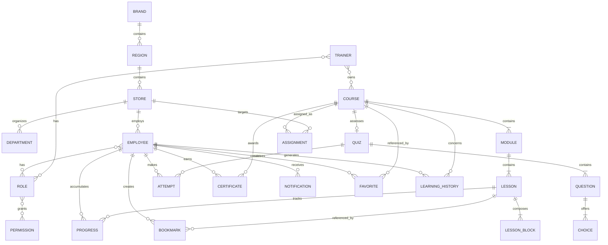

# Domain Model

## Mục lục

- [Phạm vi](#phạm-vi)
- [Mô hình quan hệ](#mô-hình-quan-hệ)
- [Danh mục thực thể](#danh-mục-thực-thể)
- [Bất biến nghiệp vụ](#bất-biến-nghiệp-vụ)

## Phạm vi

Mô hình này mô tả ngôn ngữ nghiệp vụ chung, chưa quyết định công nghệ lưu trữ. `Employee` và `Trainer` là hồ sơ/ngữ cảnh vai trò của một người dùng, không bắt buộc là hai bảng đăng nhập riêng.

## Mô hình quan hệ

## Danh mục thực thể

| Thực thể | Trách nhiệm | Thuộc tính chính | Quan hệ chính |
|---|---|---|---|
| Brand | Đơn vị thương hiệu cấp cao nhất | id, name, code, status | Có nhiều Region |
| Region | Phân vùng vận hành | id, brandId, name, code | Thuộc Brand, có nhiều Store |
| Store | Cửa hàng/đơn vị học tập | id, regionId, name, code, timezone | Thuộc Region, có Employee và Department |
| Department | Nhóm chức năng trong cửa hàng | id, storeId, name | Thuộc Store, nhóm Employee |
| Employee | Người học trong bối cảnh tổ chức | userId, employeeCode, storeId, departmentId, status | Có Role, Progress, Attempt |
| Trainer | Người xây dựng và theo dõi nội dung | userId, scope, status | Có Role, sở hữu Course |
| Role | Tập quyền có tên | id, code, name | Gán cho người dùng, chứa Permission |
| Permission | Quyền hành động nguyên tử | id, resource, action, scopeType | Thuộc nhiều Role |
| Course | Đơn vị học có thể xuất bản/gán | id, ownerId, title, category, status, version | Có Module, Quiz, Assignment |
| Module | Nhóm bài có thứ tự | id, courseId, title, order | Thuộc Course, có Lesson |
| Lesson | Đơn vị học và tiến độ | id, moduleId, title, order, required, duration | Có LessonBlock và Progress |
| LessonBlock | Khối nội dung có kiểu và thứ tự | id, lessonId, type, payload, order, version | Thuộc Lesson |
| Quiz | Bài đánh giá của khóa học | id, courseId, passScore, attemptPolicy | Có Question và Attempt |
| Question | Câu hỏi có chấm điểm | id, quizId, type, prompt, weight, lessonRef | Có Choice, liên kết bài cần ôn |
| Choice | Phương án trả lời | id, questionId, label, isCorrect, order | Thuộc Question |
| Progress | Trạng thái hoàn thành một bài | id, userId, lessonId, status, completedAt | Duy nhất theo user + lesson |
| Attempt | Lần nộp quiz bất biến | id, userId, quizId, score, passed, submittedAt | Thuộc Employee và Quiz |
| Certificate | Chứng nhận hoàn thành | id, userId, courseId, issuedAt, certificateNo | Duy nhất theo chính sách khóa |
| Assignment | Yêu cầu học cho một phạm vi | id, courseId, targetType, targetId, dueAt, status | Nhắm Store/nhóm/người dùng |
| Notification | Thông điệp gửi cho một người | id, userId, type, title, readAt, channel | Có thể tham chiếu Assignment |
| Bookmark | Điểm lưu trong nội dung | id, userId, lessonId, blockId, note | Thuộc người dùng và Lesson |
| Favorite | Khóa học người dùng quan tâm | id, userId, courseId, createdAt | Duy nhất theo user + course |
| LearningHistory | Nhật ký nghiệp vụ học tập | id, userId, courseId, eventType, occurredAt | Dùng cho hành trình/analytics |

## Bất biến nghiệp vụ

- Một `Course` đã publish phải tham chiếu một phiên bản nội dung bất biến; chỉnh sửa tạo draft/version mới.
- `Progress` hoàn thành là idempotent và duy nhất theo người dùng–bài học; quiz không phải lesson progress.
- `Attempt` đã submit không được sửa; làm lại tạo bản ghi mới.
- `Certificate` chỉ phát hành khi thỏa điều kiện khóa học và phải truy vết được phiên bản.
- Quyền luôn là tổ hợp role, action và scope; UI chỉ phản ánh, backend tương lai mới thực thi.
- `LearningHistory` phục vụ hành trình; audit quản trị được mô tả riêng trong [Database Blueprint](05-database-blueprint.md).

Xem thêm [Permission Matrix](06-permission-matrix.md) và [API Blueprint](08-api-blueprint.md).
