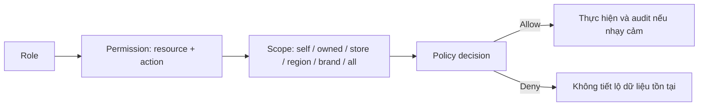

# Permission Matrix

## Mục lục

- [Quy ước](#quy-ước)
- [Ma trận tổng quan](#ma-trận-tổng-quan)
- [Phạm vi dữ liệu](#phạm-vi-dữ-liệu)
- [Quy tắc thực thi](#quy-tắc-thực-thi)

## Quy ước

`Self` = chính người dùng; `Owned` = nội dung do trainer phụ trách; `Store` = cửa hàng được phân công; `All` = toàn hệ thống; `—` = không có quyền. Delete trong CMS là archive, không xóa vật lý.

## Ma trận tổng quan

| Vai trò | View | Create | Edit | Delete | Publish | Assign | Export | Analytics | Approval |
|---|---|---|---|---|---|---|---|---|---|
| Employee | Khóa được phép; Self | Bookmark/Favorite | Self | Self | — | — | Self certificate | Self | — |
| Trainer | Published + Owned | Course/content | Owned draft | Owned draft | Khi được cấp quyền | Nhóm được cấp scope | Owned/scope | Owned/scope | Gửi review; duyệt nếu tách nhiệm vụ |
| Store Manager | Store | Reminder | Assignment trong Store | — | — | Store | Store | Store | Xác nhận assignment ngoại lệ |
| Super Admin | All | All | All | Archive All | All | All | All | All | All |

### Chi tiết theo tài nguyên

| Tài nguyên | Employee | Trainer | Store Manager | Super Admin |
|---|---|---|---|---|
| Course/content | Học nội dung được publish | CRUD draft owned; preview | View published | Quản trị toàn bộ vòng đời |
| Quiz/attempt | Làm quiz; xem attempt của mình | Soạn quiz; xem tổng hợp | Xem tổng hợp Store | Quản trị và điều tra có audit |
| Progress/certificate | Self | Aggregate theo scope | Nhân viên Store | All theo policy |
| Assignment | Xem assignment của mình | Tạo nếu được ủy quyền | Tạo/nhắc trong Store | All scopes |
| Organization | Xem thông tin tối thiểu | Scope được cấp | Store của mình | Brand/Region/Store |
| User/role | Self profile hạn chế | — | Danh sách Store hạn chế | Quản trị role và scope |
| Analytics/export | Self | Nội dung/scope | Store | All; export nhạy cảm có audit |
| Media/settings | — | Media owned/shared được cấp | — | Toàn hệ thống |

## Phạm vi dữ liệu

## Quy tắc thực thi

- Backend tương lai là nguồn quyết định quyền; route guard/frontend chỉ cải thiện UX.
- Quyền mặc định deny; mọi truy vấn phải gắn scope từ session, không nhận scope tin cậy từ client.
- Publish và approval nên tách người khi tổ chức bật four-eyes principle.
- Export, thay role, publish, archive và xem dữ liệu nhạy cảm phải ghi `activity_logs`.
- Store Manager chuyển cửa hàng phải mất quyền scope cũ ngay khi membership hết hiệu lực.
- Dữ liệu analytics cá nhân chỉ hiện cho vai trò và mục đích đã phê duyệt.

Xem [User Flows](03-user-flows.md), [CMS Blueprint](07-cms-blueprint.md) và [API Blueprint](08-api-blueprint.md).
