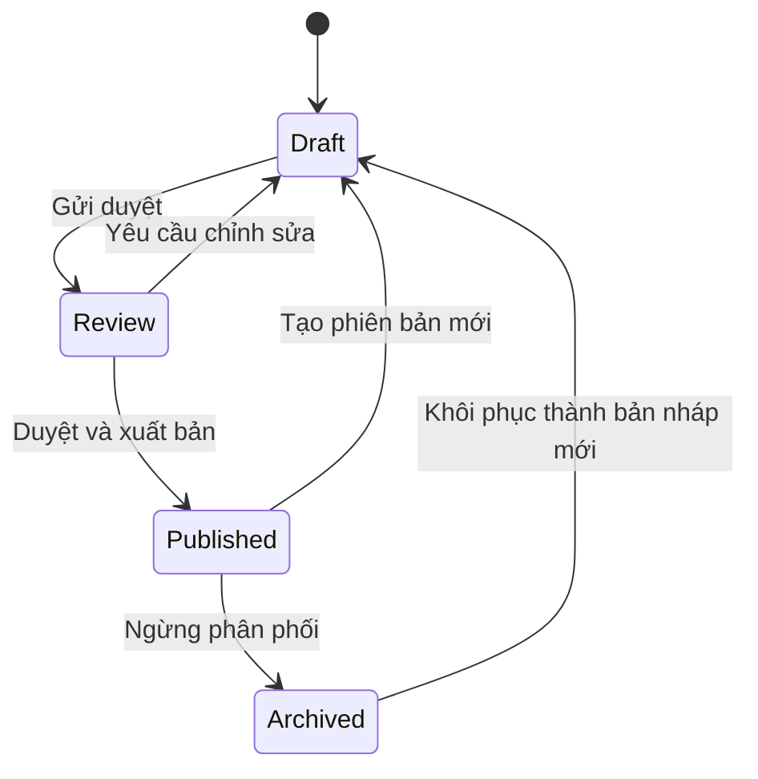

# CMS Blueprint

## Mục lục

- [Cấu trúc CMS](#cấu-trúc-cms)
- [Vòng đời nội dung](#vòng-đời-nội-dung)
- [Block Editor](#block-editor)
- [Hành vi và kiểm soát](#hành-vi-và-kiểm-soát)
- [Tiêu chí sẵn sàng triển khai](#tiêu-chí-sẵn-sàng-triển-khai)

## Cấu trúc CMS

| Khu vực | Mục tiêu | Màn hình chính |
|---|---|---|
| Dashboard | Ưu tiên công việc | Draft gần đây, chờ review, cảnh báo, hoạt động |
| Course | Quản trị metadata và cấu trúc | Danh sách, overview, version, preview |
| Module | Sắp xếp chương | Outline, reorder, trạng thái hoàn thiện |
| Lesson | Soạn nội dung | Block editor, preview responsive, validation |
| Quiz | Soạn đánh giá | Question bank, đáp án, pass score, mapping lesson |
| Analytics | Đánh giá hiệu quả | Completion, score, weak content, drill-down |
| Media | Quản trị tài sản | Upload, metadata, usage, replacement, archive |
| Settings | Chính sách CMS | Category, review, publish, certificate, attempt |

## Vòng đời nội dung

- Draft được autosave và chỉ editor có scope thấy.
- Review khóa thay đổi nội dung trọng yếu; comment có người phụ trách và trạng thái.
- Publish tạo snapshot/version bất biến, kiểm tra lỗi chặn và xác nhận tác động.
- Archive ngừng assignment mới nhưng giữ lịch sử, attempt và certificate.

## Block Editor

| Block | Mục đích | Validation tối thiểu |
|---|---|---|
| Heading | Cấu trúc nội dung | Cấp heading hợp lệ, không bỏ trống |
| Paragraph | Nội dung diễn giải | Plain/rich text an toàn |
| Image | Minh họa | Alt text, nguồn/quyền sử dụng |
| Video | Nội dung media | Caption/transcript, poster, duration |
| Checklist | Các bước cần nhớ | Ít nhất một mục |
| Scenario | Tình huống bán hàng | Bối cảnh, mục tiêu, kết luận |
| Dialogue | Hội thoại mẫu | Speaker rõ ràng, thứ tự |
| Quote | Trích dẫn | Nội dung và attribution nếu có |
| Comparison | So sánh có cấu trúc | Ít nhất hai đối tượng |
| Table | Dữ liệu hàng/cột | Header, caption, mobile strategy |
| Quiz | Câu hỏi kiểm tra tại chỗ | Đáp án và feedback; không tính final quiz trừ cấu hình |
| Attachment | Tài liệu tải/xem | Tên, loại, dung lượng, accessibility |

Thanh công cụ hỗ trợ thêm block, kéo thả/reorder bằng chuột và bàn phím, duplicate, delete có undo, collapse outline, preview và điều hướng lỗi. Payload block có version để migration độc lập.

## Hành vi và kiểm soát

- Autosave hiển thị trạng thái `Đang lưu / Đã lưu / Lỗi`; không làm mất bản local khi mạng lỗi.
- Optimistic concurrency cảnh báo khi có phiên bản mới, không ghi đè im lặng.
- Validation phân biệt lỗi chặn publish và cảnh báo; click lỗi đưa focus đúng trường/block.
- Preview dùng đúng renderer Employee và có mobile/tablet/desktop.
- Quiz bắt buộc map câu hỏi khó về lesson để hỗ trợ “học lại nội dung cần cải thiện”.
- Media hiển thị nơi đang sử dụng trước replace/archive; upload kiểm tra loại, dung lượng và metadata.
- Publish cần quyền, changelog, optional reviewer và audit trail.
- Empty, loading, error, permission-denied và unsaved-changes là state bắt buộc cho mọi màn hình.

## Tiêu chí sẵn sàng triển khai

- Luồng tạo Course → Module → Lesson → Quiz → Preview → Review → Publish có prototype và acceptance criteria.
- Contract block/version, quyền, validation và recovery đã được thống nhất.
- Không có đường publish bỏ qua permission/audit.
- Nội dung đã publish không bị chỉnh sửa tại chỗ.

Xem [Permission Matrix](06-permission-matrix.md), [API Blueprint](08-api-blueprint.md) và [Design Decisions](10-design-decisions.md).
