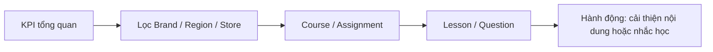

# Analytics Design

## Mục lục

- [Nguyên tắc](#nguyên-tắc)
- [Dashboard theo vai trò](#dashboard-theo-vai-trò)
- [Metric dictionary](#metric-dictionary)
- [Drill-down và cảnh báo](#drill-down-và-cảnh-báo)
- [Dữ liệu và quyền riêng tư](#dữ-liệu-và-quyền-riêng-tư)

## Nguyên tắc

Analytics phải dẫn đến hành động học tập, không dùng để giám sát thiếu minh bạch. Mọi biểu đồ hiển thị phạm vi, khoảng thời gian, múi giờ, bộ lọc và thời điểm làm mới. Một metric chỉ được phát hành khi có định nghĩa, owner và kiểm tra chất lượng.

## Dashboard theo vai trò

| Vai trò | Câu hỏi chính | Thành phần |
|---|---|---|
| Trainer | Nội dung có hiệu quả không, khó ở đâu? | Completion Rate, Average Score, Top Difficult Questions, Weak Lessons, Weak Stores, Learning Heatmap, Recent Activities |
| Store Manager | Cửa hàng cần hỗ trợ ai và việc gì? | Shop Progress, Employees At Risk, Quiz Performance, deadline/assignment, nút nhắc học |
| Employee | Tôi đang ở đâu và nên làm gì tiếp? | Continue Learning, Learning Journey, achievements, deadline, latest result |
| Super Admin | Chương trình vận hành ra sao giữa đơn vị? | Brand/Region/Store comparison, adoption, assignment coverage, data quality |

## Metric dictionary

| Metric | Định nghĩa chuẩn | Phân đoạn mặc định |
|---|---|---|
| Completion Rate | Số người hoàn thành khóa / số người đủ điều kiện hoặc được assignment trong cohort | Course, store, region, thời gian |
| Average Score | Trung bình điểm attempt gần nhất đã submit của cohort; hiển thị thêm phân phối | Course, quiz, store |
| Difficult Question | Tỷ lệ trả lời sai trên các attempt hợp lệ; chỉ hiển thị khi đủ mẫu | Question, course version |
| Weak Lesson | Lesson liên quan câu sai cao hoặc drop-off cao; là tín hiệu, không kết luận nhân quả | Lesson, version, cohort |
| Weak Store | Store thấp hơn benchmark có kiểm soát quy mô/cohort; tên gọi UI nên trung tính “Cần hỗ trợ” | Region, course |
| Shop Progress | Trung bình completion của assignment đang hiệu lực trong store | Store, deadline |
| Employee At Risk | Assignment sắp quá hạn và tiến độ thấp theo rule minh bạch | Store, assignment |
| Learning Heatmap | Số learning events hoặc active learners theo ngày/giờ, không phải thời gian màn hình giả định | Scope, timezone |
| Recent Activity | Sự kiện học/quản trị được phép xem, sắp theo thời gian | Role scope |
| Achievement | Mốc có quy tắc xác định, truy vết được | Employee |

Mỗi metric cần lưu numerator, denominator, cohort rule và version định nghĩa để tránh dashboard khác nhau cho cùng tên gọi.

## Drill-down và cảnh báo

- Trainer đi từ completion → store/cohort → lesson/question, sau đó mở CMS đúng version.
- Store Manager đi từ assignment → danh sách at-risk → nhắc học có xác nhận và audit.
- Employee chỉ thấy dữ liệu của mình và CTA cụ thể; không có bảng xếp hạng gây áp lực mặc định.
- Cảnh báo cần threshold, owner, cooldown và trạng thái acknowledged để tránh spam.

## Dữ liệu và quyền riêng tư

- Event tối thiểu: course viewed, lesson started/completed, quiz draft saved/submitted, certificate issued, assignment created/reminded, content published.
- Event có actor, entity/version, scope, timestamp, source và correlation ID; không gửi nội dung câu trả lời thô nếu không cần.
- Dữ liệu cá nhân bị giới hạn bởi [Permission Matrix](06-permission-matrix.md); bảng so sánh nhỏ áp dụng minimum cohort threshold.
- Late events và timezone có quy tắc; số liệu hiển thị freshness và trạng thái partial.
- Reconciliation định kỳ so progress/attempt nguồn với aggregate; metric lỗi phải được gắn cảnh báo, không hiển thị như dữ liệu chắc chắn.

Xem [Domain Model](04-domain-model.md), [API Blueprint](08-api-blueprint.md) và [Risk Assessment](12-risk-assessment.md).
