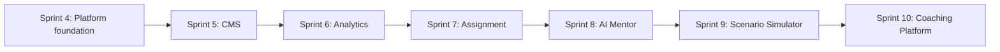

# Future Roadmap

## Mục lục

- [Nguyên tắc sequencing](#nguyên-tắc-sequencing)
- [Lộ trình Sprint 4–10](#lộ-trình-sprint-410)
- [Cổng kiểm soát](#cổng-kiểm-soát)

## Nguyên tắc sequencing

Mỗi sprint chỉ bắt đầu khi dependency và exit criteria sprint trước đạt. Phạm vi được discovery/estimate lại trước khi commit; roadmap là hướng kiến trúc, không phải cam kết ngày phát hành.

## Lộ trình Sprint 4–10

### Sprint 4 — Supabase và Authentication

- **Mục tiêu:** nền tảng dữ liệu, identity, authorization scope và migration khỏi mock/localStorage.
- **Deliverables:** schema đã review, migrations, auth/session, RLS/policy tests, audit nền, seed dev, observability, backup/restore rehearsal.
- **Exit criteria:** Employee/Trainer đăng nhập và chỉ truy cập đúng scope; progress/attempt idempotent; frontend hiện tại không hồi quy.
- **Không làm:** CMS đầy đủ, analytics nâng cao.

### Sprint 5 — CMS

- **Mục tiêu:** Trainer tạo, review, preview, publish và archive nội dung.
- **Dependency:** versioning, permission và audit Sprint 4.
- **Deliverables:** Course/Module/Lesson/Quiz, block editor, media cơ bản, optimistic concurrency, publish workflow.
- **Exit criteria:** một khóa đi trọn draft → review → publish; published snapshot bất biến; accessibility và recovery đạt QA.

### Sprint 6 — Analytics

- **Mục tiêu:** dashboard đáng tin cậy cho Trainer, Store Manager và Employee.
- **Dependency:** event/domain data ổn định và metric dictionary được duyệt.
- **Deliverables:** pipeline/projection, KPI, filters/drill-down, freshness, data-quality monitor, privacy thresholds.
- **Exit criteria:** KPI reconcile với nguồn; scope test; dashboard dẫn tới hành động rõ.

### Sprint 7 — Assignment

- **Mục tiêu:** giao khóa theo tổ chức, deadline và nhắc học có kiểm soát.
- **Deliverables:** target resolver, assignment lifecycle, inbox/reminder, Store Manager workflow, audit.
- **Exit criteria:** thay đổi membership không rò scope; gửi nhắc idempotent; trạng thái quá hạn chính xác theo timezone.

### Sprint 8 — AI Mentor

- **Mục tiêu:** hỗ trợ giải thích và gợi ý ôn tập dựa trên nội dung đã duyệt.
- **Điều kiện bắt buộc:** policy dữ liệu, grounding/citation, evaluation set, human escalation, cost/rate limit, opt-out.
- **Exit criteria:** không tự tạo chính sách bán hàng; trả lời có nguồn/version; red-team và quality threshold đạt.

### Sprint 9 — Scenario Simulator

- **Mục tiêu:** luyện hội thoại tư vấn trong kịch bản an toàn.
- **Deliverables:** scenario authoring, rubric, simulation, feedback, privacy controls.
- **Exit criteria:** rubric nhất quán, không đánh giá đặc điểm nhạy cảm, Trainer kiểm soát nội dung và appeal path.

### Sprint 10 — Coaching Platform

- **Mục tiêu:** nối insight học tập với kế hoạch coaching giữa quản lý và nhân viên.
- **Deliverables:** coaching plan, goals, check-ins, evidence links, progress review, retention/access policy.
- **Exit criteria:** consent và visibility rõ; không biến dữ liệu học thành giám sát mơ hồ; đo được hiệu quả hỗ trợ.

## Cổng kiểm soát

| Gate | Điều kiện |
|---|---|
| Product | Problem, user outcome, KPI và non-goal được duyệt |
| Architecture | Contract, migration, rollback, observability và ownership rõ |
| Security | Threat model, scope tests, audit, secrets, retention và backup đạt |
| Quality | Type/lint/test/build, accessibility, responsive và regression đạt |
| Data | Metric/event definition, lineage, privacy và reconciliation đạt |
| Release | Pilot, support runbook, feature flag và rollback rehearsal hoàn tất |

Rủi ro và biện pháp kiểm soát tại [Risk Assessment](12-risk-assessment.md); quyết định nền tại [Design Decisions](10-design-decisions.md).
