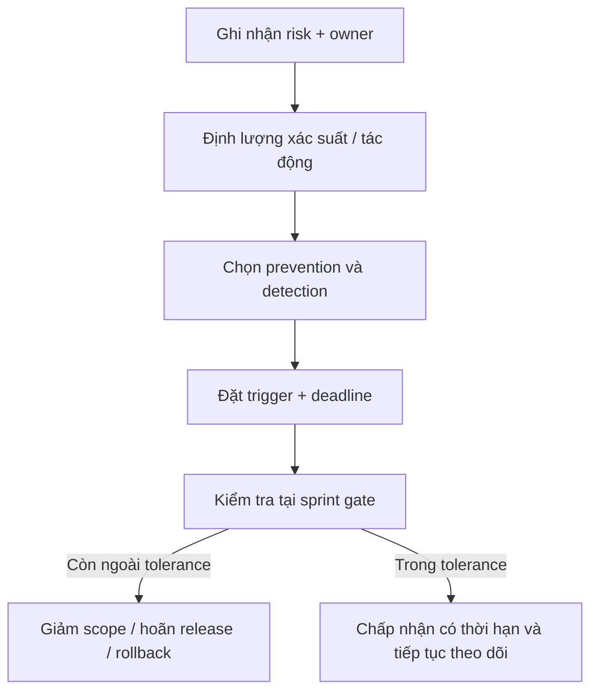

# Risk Assessment

## Mục lục

- [Thang đánh giá](#thang-đánh-giá)
- [Technical Risks](#technical-risks)
- [Business Risks](#business-risks)
- [Security Risks](#security-risks)
- [Scalability và Performance Risks](#scalability-và-performance-risks)
- [Mitigation Plan](#mitigation-plan)

## Thang đánh giá

Xác suất và tác động: Thấp (T), Trung bình (TB), Cao (C). Risk owner phải theo dõi trigger và cập nhật tại mỗi architecture/release review.

## Technical Risks

| Rủi ro | Xác suất | Tác động | Mitigation / trigger | Owner |
|---|---:|---:|---|---|
| Mock/localStorage lệch mô hình thật | C | C | Contract tests, migration plan; trigger khi Sprint 4 bắt đầu | Tech Lead |
| Course version không bất biến | TB | C | Version snapshot + integration tests trước CMS publish | Backend Lead |
| Race condition progress/attempt | TB | C | Unique constraint, idempotency, concurrent tests | Backend Lead |
| Block payload khó migration | TB | C | Schema version, registry, fixture migration tests | CMS Lead |
| Frontend/backend contract drift | TB | TB | API contract review, generated fixtures, compatibility policy | FE/BE Leads |
| Analytics sai định nghĩa | TB | C | Metric dictionary, owner, reconciliation, freshness | Data Owner |

## Business Risks

| Rủi ro | Xác suất | Tác động | Mitigation / trigger | Owner |
|---|---:|---:|---|---|
| Nội dung không theo nhu cầu cửa hàng | TB | C | Pilot theo store, feedback loop, content review cadence | Product/Training |
| Quản lý dùng số liệu để gây áp lực | TB | C | Minh bạch metric, coaching-first UX, governance và appeal | Product/HR |
| Trainer không chấp nhận CMS | TB | C | Usability test, template, autosave/recovery, onboarding | Product |
| Reminder gây spam | C | TB | Preference, cooldown, caps, delivery analytics | Product/Ops |
| Scope roadmap quá rộng | C | C | Exit criteria, feature flag, không khởi động khi dependency thiếu | Sponsor/PM |

## Security Risks

| Rủi ro | Xác suất | Tác động | Mitigation / trigger | Owner |
|---|---:|---:|---|---|
| Rò dữ liệu chéo store/region | TB | C | Server-side scope, RLS/policy tests, deny-by-default | Security/BE |
| UI guard bị coi là bảo mật | TB | C | Backend authorization mọi endpoint, security acceptance test | Tech Lead |
| Export chứa dữ liệu cá nhân | TB | C | Permission, purpose, watermark/expiry, audit, minimum fields | Data Owner |
| Media upload độc hại/bản quyền | TB | C | Type/size scan, quarantine, provenance, signed access | Security/CMS |
| Token/session bị lạm dụng | TB | C | Secure cookie/session, rotation, timeout, revoke, rate limit | Security |
| Audit log thiếu hoặc bị sửa | TB | C | Append-only access, retention, alert trên hành động nhạy cảm | Security/Ops |
| AI làm lộ dữ liệu hoặc bịa nội dung | TB | C | Không mở Sprint 8 trước governance/evaluation/grounding | AI Owner |

## Scalability và Performance Risks

| Rủi ro | Xác suất | Tác động | Mitigation / trigger | Owner |
|---|---:|---:|---|---|
| N+1 ở course/progress dashboard | TB | TB | Query budget, aggregate/projection, tracing | Backend Lead |
| Analytics quét transaction tables | TB | C | Async projections, partition/retention, cache có freshness | Data Lead |
| Media làm tải lesson chậm | C | TB | CDN, responsive assets, lazy load, budgets | FE/CMS Lead |
| Assignment fan-out lớn | TB | C | Target resolution async, chunking, idempotent jobs | Backend Lead |
| Notification burst | TB | TB | Queue, rate control, provider retry/dead letter | Platform Lead |
| Block lesson quá dài trên mobile | TB | TB | Content budget, virtualization khi đo thấy cần, performance QA | FE Lead |

## Mitigation Plan

Ưu tiên trước Sprint 4: threat model identity/scope, strategy versioning, migration localStorage, data classification, backup/restore và observability baseline. Trước mỗi release phải có owner trực, runbook, rollback/feature flag và bằng chứng kiểm thử. Risk “C/C” không được chấp nhận ngầm; sponsor và technical owner phải ký quyết định có thời hạn.

Tham chiếu [Future Roadmap](11-future-roadmap.md), [Permission Matrix](06-permission-matrix.md) và [Analytics Design](09-analytics-design.md).
