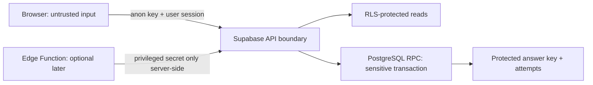

# Supabase Security Model — Sprint 4

## Mục lục

- [Security objectives](#security-objectives)
- [Trust boundaries](#trust-boundaries)
- [RLS intent](#rls-intent)
- [Quiz threat model](#quiz-threat-model)
- [Sensitive operations](#sensitive-operations)
- [Security acceptance criteria](#security-acceptance-criteria)
- [Deferred security concerns](#deferred-security-concerns)

## Security objectives

1. Anonymous không đọc dữ liệu học tập hoặc profile.
2. Employee chỉ đọc published content và dữ liệu học của chính mình.
3. Trainer đọc draft + published nhưng không mutation content/user.
4. Answer key không thể lấy trước submit bằng bất kỳ request hợp lệ nào của Employee.
5. Score, passed, ownership và timestamps do server quyết định.
6. localStorage, URL parameter và request body không bao giờ là authority cho user/role/store.

## Trust boundaries

- Browser và mọi dữ liệu từ browser đều không đáng tin, kể cả authenticated session input.
- Supabase anon key có thể hiện diện trong browser; nó không thay thế RLS.
- Service-role key không được đưa vào frontend, localStorage, logs hoặc client environment.
- Auth identity là `auth.uid()`/session đã xác thực; không nhận `user_id` do client chọn cho mutation owner.

## RLS intent

Đây là policy intent, không phải SQL.

| Resource | Anonymous | Employee | Trainer | Mutation intent |
|---|---|---|---|---|
| Profiles | Deny | Read/update trường self được phép | Self only | Role/store assignment không do browser thực hiện |
| Stores | Deny | Read metadata tối thiểu cần cho profile | Tương tự Employee | Không mutation qua app |
| Courses | Deny | SELECT status published | SELECT draft + published | Không INSERT/UPDATE/DELETE Sprint 4 |
| Modules/Lessons/Blocks | Deny | SELECT khi parent course published | SELECT khi parent draft/published | Không mutation Sprint 4 |
| Quizzes/Questions/Safe Choices | Deny | SELECT khi course published | SELECT khi course draft/published | Không mutation Sprint 4 |
| Correct-answer source | Deny | Không SELECT | Không direct SELECT qua app | Chỉ RPC grading đọc nội bộ |
| Progress | Deny | SELECT own; mutation own qua invariant-safe operation | Own learning record nếu dùng learning flow | Không chọn owner từ request body |
| Attempts/Attempt answers | Deny | SELECT own | SELECT own | INSERT chỉ từ grading RPC; append-only |
| Migration markers | Deny | SELECT own; create qua migration operation | Own | Unique theo user + migration version |

Child content không được phép đọc chỉ vì biết ID; policy phải xác minh parent course status. Store chưa tham gia access scope Sprint 4.

### Role authority

- Mỗi profile có một primary role `employee` hoặc `trainer`.
- User không tự thay role.
- RLS không tin `user_metadata` có thể chỉnh từ client.
- Cơ chế lưu role phải là app-owned và chỉ trusted provisioning được mutation.
- Schema/identity mapping cần cho phép chuyển sang role membership nhiều-nhiều sau này mà không đổi Auth identity.

## Quiz threat model

### Tài sản cần bảo vệ

- Correct choice/answer key trước submit.
- Explanation hoặc remediation text nếu chúng làm lộ đáp án.
- Attempt ownership, selected answers, score và pass/fail.
- Grading rules/pass threshold và tính toàn vẹn lịch sử attempt.

### Threats và controls

| Threat | Attack path | Control bắt buộc | Test bằng chứng |
|---|---|---|---|
| Đọc `is_correct` trực tiếp | Query bảng/view choices bằng Supabase client | Không grant/RLS SELECT answer source; safe projection loại trường | Employee session query bị deny hoặc field không tồn tại trong projection |
| Đoán endpoint/table | REST introspection hoặc crafted request | Không expose protected relation cho role Employee | Direct request không trả answer key |
| Tự chấm điểm | Gửi score/passed trong payload | RPC bỏ qua/không nhận trường này; server tính | Payload giả mạo không đổi result |
| Submit thay người khác | Gửi user_id khác | RPC lấy caller từ Auth context | Attempt owner luôn là caller |
| Submit quiz không hợp lệ | quiz draft/archived hoặc course không accessible | RPC kiểm tra quiz, status và quyền | Invalid quiz bị từ chối không ghi partial data |
| Duplicate retry | Network retry tạo nhiều attempt | Idempotency token/ràng buộc transaction | Cùng token trả cùng logical result |
| Partial write | Attempt tạo nhưng answers thiếu | Một database transaction | Fault test rollback toàn bộ |
| Đọc attempt người khác | Thay attempt ID | Owner RLS | Cross-user read deny |
| Suy ra đáp án từ draft result | Endpoint preview trả explanation/correctness | Pre-submit contract chỉ prompt + neutral choices | Contract snapshot không có sensitive fields |
| Function privilege escalation | RPC `security definer` quá rộng | Fixed search path, schema qualification, minimal execute, input validation | Security review và unauthorized function tests |

### Submission contract intent

RPC nhận quiz identifier, danh sách answer theo question/choice và idempotency token. RPC phải xác thực caller; kiểm tra quiz/course accessible; xác minh question/choice thuộc quiz; xử lý câu bỏ trống; đọc answer key nội bộ; tính score/pass theo server policy; tạo attempt + answer records atomically; trả result đã được phép gồm correct answer/explanation sau submit.

Không trả answer key hàng loạt ngoài result của attempt vừa được ủy quyền. Không dùng Edge Function chỉ để che một bảng có RLS sai; nếu RPC đủ đáp ứng transaction và policy thì RPC là lựa chọn mặc định.

## Sensitive operations

| Operation | Cơ chế ưu tiên | Lý do |
|---|---|---|
| Read published/draft content | Supabase client + RLS | Đơn giản, không chứa secret khi projection đúng |
| Complete lesson | Constrained upsert hoặc RPC | Phải idempotent và owner-safe; chọn RPC nếu invariant không bảo vệ được chỉ bằng constraint/RLS |
| Submit quiz | PostgreSQL RPC | Cần answer key và transaction server-side |
| Provision role/profile | Trusted operational path | Browser không được assign role |
| Email/integration | Edge Function trong sprint sau | Cần third-party secret/network |

## Security acceptance criteria

- RLS bật trên mọi bảng exposed trước khi dữ liệu được đưa vào môi trường dùng chung.
- Anonymous denial test pass cho toàn bộ resource Sprint 4.
- Employee không đọc draft; Trainer đọc draft nhưng cả hai không mutation content.
- Cross-user profile/progress/attempt read và write đều bị deny.
- Answer key không xuất hiện trong network payload, generated types dành cho Employee, cache, logs hoặc error response trước submit.
- RPC không nhận authority fields từ client và không để lại partial writes.
- Service-role key scan không tìm thấy trong browser bundle/repository.
- Rate/abuse strategy cho quiz submit được ghi nhận trước production pilot.
- Security review phải chạy lại khi view, RPC signature hoặc RLS policy thay đổi.

## Deferred security concerns

Store/Region scope, CMS mutation, publish approval, media Storage, assignment fan-out, export, notification provider, full audit và Realtime authorization được hoãn. Không tạo policy “tạm thời allow all” để chuẩn bị các tính năng này.

Tham chiếu [Sprint 4 Scope](15-sprint-4-scope.md) và [localStorage Migration Plan](17-localstorage-migration-plan.md).
