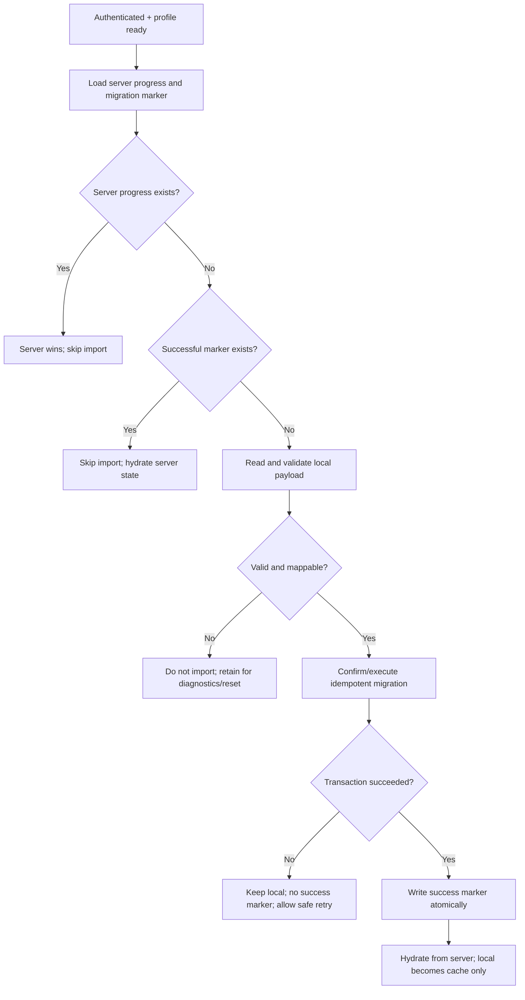

# localStorage Migration Plan — Sprint 4

## Mục lục

- [Mục tiêu](#mục-tiêu)
- [Nguồn dữ liệu hiện tại](#nguồn-dữ-liệu-hiện-tại)
- [Source-of-truth rules](#source-of-truth-rules)
- [Migration state machine](#migration-state-machine)
- [Validation và mapping](#validation-và-mapping)
- [Failure và recovery](#failure-và-recovery)
- [Acceptance criteria](#acceptance-criteria)
- [Cutover và deprecation](#cutover-và-deprecation)

## Mục tiêu

Cho phép một người dùng giữ tiến độ prototype hợp lệ trong lần đăng nhập đầu tiên mà không để dữ liệu browser ghi đè dữ liệu Supabase. Migration là one-time, observable và idempotent; localStorage không còn là nguồn thật sau cutover.

## Nguồn dữ liệu hiện tại

| Key | Nội dung hiện tại | Xử lý Sprint 4 |
|---|---|---|
| `fstudio-learning-role` | Mock role `employee`/`trainer` | Không migrate, không dùng authorization; Auth/profile quyết định role |
| `fstudio-learning-progress` | schemaVersion 2: completedLessonIds, current lesson/course, courseProgress, quizDraft, quizAttempts, latest result, updatedAt | Chỉ xem xét import progress lesson hợp lệ; không tin derived percentage hoặc ownership |

Quiz draft có thể tiếp tục là cache local trong Sprint 4. Submitted quiz attempts local không tự động được coi là kết quả chính thức vì đã được chấm hoàn toàn ở client và không có identity/server integrity. Nếu Product muốn import attempt lịch sử, cần quyết định riêng; mặc định không import.

## Source-of-truth rules

1. Supabase luôn thắng khi đã có bất kỳ progress server hợp lệ cho user/course.
2. Local chỉ được xét khi user authenticated, server chưa có progress và chưa có migration marker thành công.
3. Chỉ import ID lesson thuộc course seed hiện tại và trạng thái hoàn thành hợp lệ.
4. Không import `courseProgress` vì đây là giá trị derived; server tính lại từ lesson required.
5. Không import mock role, score/pass, answer key hoặc owner identity từ browser.
6. Marker chỉ được ghi sau khi import transaction thành công.
7. Retry phải idempotent và không tạo duplicate.

## Migration state machine

Nếu server progress xuất hiện giữa bước kiểm tra và import, transaction phải phát hiện conflict và chọn server; không merge mù.

## Validation và mapping

### Điều kiện local payload hợp lệ

- Parse được và đúng schema version được hỗ trợ.
- `completedLessonIds` là danh sách string, không duplicate sau normalize.
- Mọi lesson ID được import tồn tại trong published course seed hiện tại.
- Course ID khớp `mac-back-to-school`; ID placeholder bị bỏ qua.
- Giá trị không vượt quyền: không nhận user ID, role hoặc server timestamp từ local.
- Payload vượt giới hạn kích thước/số lượng bị từ chối và ghi lỗi an toàn.

### Mapping

| Local field | Backend action | Quy tắc |
|---|---|---|
| completedLessonIds | Tạo/upsert progress completed | Chỉ ID hợp lệ; idempotent |
| currentLessonId/currentCourseId | Có thể dùng làm UX hint sau khi validate | Không phải completion authority |
| courseProgress | Không import | Tính lại từ required lessons |
| quizDraft | Giữ cache local | Không tạo official attempt |
| quizAttempts/latestQuizResult | Không import mặc định | Client-graded, không đủ integrity |
| updatedAt | Chỉ telemetry tham khảo nếu cần | Không thắng server timestamp |
| schemaVersion | Chọn parser/migration path | Unsupported version không import |

### Migration marker intent

Marker gắn authenticated user, migration key/version, trạng thái thành công và server timestamp. Unique theo user + migration version. Marker và progress import nên nằm trong cùng transaction hoặc một RPC đảm bảo không có trạng thái “đã migrate” nhưng progress chưa ghi.

## Failure và recovery

| Tình huống | Hành vi |
|---|---|
| local JSON hỏng/unsupported | Không import; app tiếp tục bằng server state rỗng; cung cấp diagnostic không chứa payload nhạy cảm |
| Mạng lỗi trước transaction | Giữ local, không marker, retry có backoff |
| Transaction rollback | Không partial progress/marker; giữ local |
| Server đã có progress | Bỏ qua local; hydrate server |
| Hai tab migrate cùng lúc | Unique/idempotency bảo đảm một kết quả; tab còn lại reload server |
| Lesson local không còn tồn tại | Bỏ ID không map; nếu không còn ID hợp lệ thì không import |
| User đăng nhập nhầm account trên thiết bị dùng chung | Không auto-import mù nếu có nguy cơ; UX cần xác nhận rõ trước lần import đầu |
| Import thành công nhưng clear cache lỗi | Marker/server state ngăn import lại; local cũ không còn authority |

Không xóa local payload trước khi server read-back xác nhận dữ liệu mong đợi. Không log toàn bộ local payload hoặc quiz answers.

## Acceptance criteria

- Server có progress: local khác biệt không thay đổi server.
- Server trống + local hợp lệ: completed lessons hợp lệ được import đúng một lần.
- Server trống + local hỏng: không tạo progress/marker thành công giả.
- Retry, reload, hai tab và request lặp không tạo duplicate.
- Derived progress được server tính lại, không dùng phần trăm local.
- Role mock và client-graded attempts không được migrate.
- Sau success, read-back từ server là state hiển thị.
- Logout/login account khác không tự gán dữ liệu local cũ sai người.
- Migration có telemetry tối thiểu: attempted/succeeded/skipped/failed reason, không chứa PII/answers.
- Có test cho schema version 2 hiện tại và behavior với version không hỗ trợ.

## Cutover và deprecation

### Giai đoạn 1 — Dual-read có kiểm soát

Sau Auth, đọc server trước. Chỉ migration coordinator được đọc local để import; page/component không tự chọn local làm state chính.

### Giai đoạn 2 — Server-only authority

Sau migration/skip, repository luôn hydrate từ Supabase. localStorage có thể cache quiz draft hoặc snapshot không authoritative, có version và expiry.

### Giai đoạn 3 — Cleanup

Sau migration window được Product/Ops chốt, ngừng parser cũ và xóa key legacy an toàn. Migration marker giữ theo retention đủ để hỗ trợ điều tra. Feature flag rollback không được biến mock role thành authorization.

Tham chiếu [Product Owner Decisions](14-product-owner-decisions.md), [Sprint 4 Scope](15-sprint-4-scope.md) và [Supabase Security Model](16-supabase-security-model.md).
