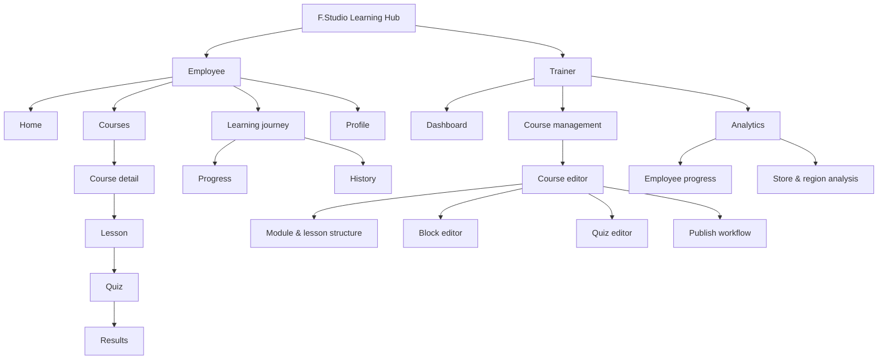
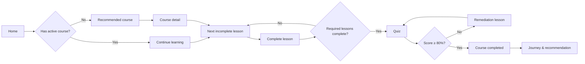
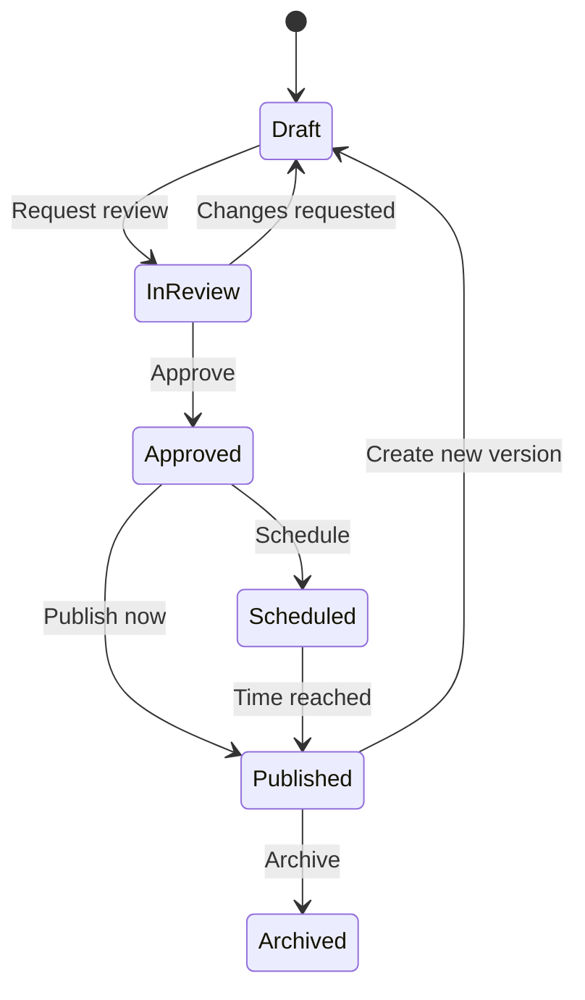
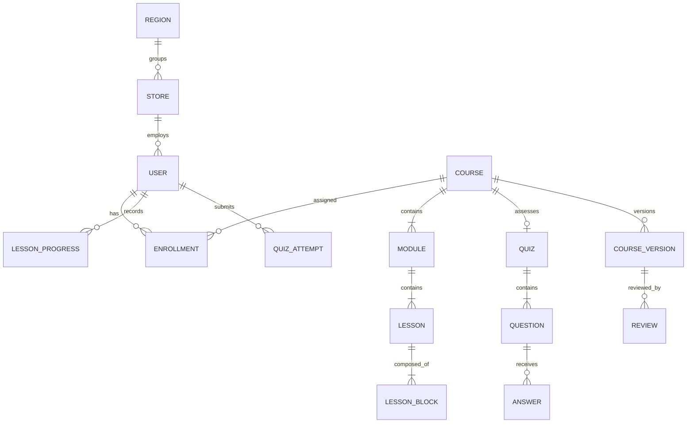

# F.Studio Learning Hub — Sprint 3 Product Architecture

## 1. Product architecture

### Product principles

1. **Next action is always obvious:** every Employee surface answers “học gì tiếp?”.
2. **Progress is explainable:** progress distinguishes lessons, quiz, and course completion.
3. **Trainer works in a safe publishing loop:** Draft → Review → Scheduled/Published → Archived.
4. **Retail context first:** store, region, product category, campaign, and training window are first-class filters.
5. **Color is identity, not decoration:** category accent appears sparingly and never carries meaning alone.

### System domains

| Domain | Responsibility | Primary role |
| --- | --- | --- |
| Learning | Catalog, lessons, quiz, results, continue learning | Employee |
| Personal progress | Journey, history, bookmarks, streak, profile | Employee |
| Content operations | Courses, modules, lessons, block editor, quizzes | Trainer |
| Publishing | Draft, review, scheduling, publish, archive | Trainer |
| Insights | Completion, score, difficult content, store and region performance | Trainer |
| Platform | Roles, notifications, taxonomy, design system | Shared |

## 2. Information architecture



### Navigation

**Employee primary:** Home, Courses, Journey. Profile sits in the account menu. On mobile: Home, Courses, Journey, Profile.

**Trainer primary:** Overview, Courses, Analytics, Employees. Editor actions are contextual and never placed in global navigation.

### Route proposal

| Role | Route | Purpose |
| --- | --- | --- |
| Employee | `/` | Personalized command center |
| Employee | `/courses` | Searchable/filterable catalog |
| Employee | `/courses/:courseId` | Outcomes, curriculum, progress, quiz gate |
| Employee | `/learn/:courseId/:lessonId` | Focused lesson reader |
| Employee | `/quiz/:courseId` | Assessment |
| Employee | `/results/:courseId` | Feedback and remediation |
| Employee | `/journey` | Timeline and current path |
| Employee | `/progress` | Skill/category progress |
| Employee | `/history` | Completed and viewed activity |
| Employee | `/profile` | Store, region, preferences |
| Trainer | `/admin` | Operational dashboard |
| Trainer | `/admin/courses` | Course inventory |
| Trainer | `/admin/courses/new` | Course setup |
| Trainer | `/admin/courses/:courseId/edit` | Editor workspace |
| Trainer | `/admin/analytics` | Learning analytics |
| Trainer | `/admin/employees` | Employee progress explorer |

## 3. UX flows

### Employee learning flow



### Trainer publishing flow



### CMS editor workflow

1. Define course basics, audience, category accent, outcomes.
2. Create ordered modules and lessons.
3. Compose lesson from blocks; autosave UI state indicates “Saved”.
4. Preview Employee experience at mobile/desktop.
5. Add quiz questions and map each question to a module/lesson.
6. Run readiness checklist: required fields, broken attachments, empty lessons, quiz coverage.
7. Request review, resolve comments, publish or schedule.

## 4. Permission matrix

| Capability | Employee | Trainer | Content reviewer | Platform admin (future) |
| --- | :---: | :---: | :---: | :---: |
| View published learning | ✓ | ✓ | ✓ | ✓ |
| Track own progress | ✓ | ✓ | ✓ | ✓ |
| View team/store analytics | — | ✓ | Read | ✓ |
| Create/edit draft | — | ✓ | Comment | ✓ |
| Request review | — | ✓ | — | ✓ |
| Approve content | — | Optional | ✓ | ✓ |
| Publish/archive | — | Configurable | Optional | ✓ |
| Manage roles/taxonomy | — | — | — | ✓ |

Sprint 3 keeps the current mock `employee`/`trainer` switch. This matrix is a backend authorization requirement, not frontend security.

## 5. UI-level entity model



### Concept-level database draft

Core entities: `users`, `roles`, `stores`, `regions`, `courses`, `course_versions`, `modules`, `lessons`, `lesson_blocks`, `quizzes`, `questions`, `assignments`, `enrollments`, `lesson_progress`, `quiz_attempts`, `quiz_answers`, `bookmarks`, `reviews`, `publish_events`.

Important constraints for a future backend:

- Course content is versioned; published versions are immutable.
- Progress references the published version used by the learner.
- Quiz attempts snapshot question and answer text for auditability.
- Analytics aggregates avoid exposing unnecessary employee-level data.
- Publish actions require server-side permission checks and an audit log.

## 6. Design system

### Color tokens

| Token | Purpose |
| --- | --- |
| `surface-canvas`, `surface-card`, `surface-subtle` | Neutral hierarchy |
| `text-primary`, `text-secondary`, `text-muted` | Typography hierarchy |
| `border-subtle`, `border-strong` | Dividers and focus boundaries |
| `action-primary`, `action-hover`, `focus-ring` | Interactive actions |
| `status-success`, `status-warning`, `status-danger`, `status-info` | Semantic states |
| `category-mac`, `category-iphone`, `category-watch`, `category-ecosystem`, `category-dji`, `category-garmin`, `category-soft-skill` | Course identity |

Category mapping: Mac/Blue, iPhone/Purple, Watch/Orange, Ecosystem/Green, DJI/Red, Garmin/Lime, Soft Skill/Cyan. Each category also has a soft surface token.

### Foundations

- Type scale: 12, 14, 16, 18, 24, 32, 44, 56.
- Spacing: 4, 8, 12, 16, 24, 32, 48, 64, 80.
- Radius: 8 (controls), 12 (compact cards), 16 (standard cards), 24 (hero surfaces), pill.
- Elevation: `flat`, `raised`, `floating`; avoid shadows on every card.
- Motion: 120–180ms for hover/state, 220ms for panel transition; respect reduced motion.

### Components

Buttons: primary, secondary, ghost, danger, icon. Inputs: label, help, error, disabled. Cards: course, metric, content, editor block. Feedback: badge, progress, skeleton, empty, error, toast. Navigation: app header, bottom nav, admin sidebar, breadcrumbs, tabs. Data display: table, KPI, chart container, heatmap, activity feed.

## 7. Wireframe proposals

### Employee Home

```text
[Header: brand | Home Courses Journey | Search | Profile]
[Greeting + Continue Learning CTA] [Weekly goal / streak]
[Active course — progress — next lesson]
[Recommended for your store/campaign]
[Recent achievements] [Learning history]
```

### Course detail

```text
[Breadcrumb]
[Category + title + outcomes + primary CTA] [Progress summary]
[Curriculum: module accordion + lesson states] [Sticky course facts]
[Quiz gate / completion certificate state]
```

### Trainer Dashboard

```text
[Sidebar] [Header: date range | region/store filters]
          [Completion] [Average score] [Active learners] [At-risk]
          [Completion trend chart] [Learning heatmap]
          [Weak lessons] [Difficult questions]
          [Recent activity]
```

### Block Editor

```text
[Sidebar: structure] [Canvas: draggable blocks] [Inspector: settings]
[Add block palette]   [Duplicate / reorder]     [Preview / status]
[Readiness checklist] [Save state]              [Request review / Publish]
```

## 8. Analytics definitions

- Completion rate: completed enrollments / eligible enrollments.
- Average score: latest passed attempt and all-attempt view, clearly labeled.
- Difficult questions: incorrect response rate with minimum response threshold.
- Weak lessons: high revisit + low downstream quiz performance.
- Weak stores/regions: normalized by eligible learners; never rank tiny cohorts without threshold.
- Learning heatmap: activity by weekday/hour in local store timezone.
- Recent activity: publishes, completions, failed attempts, review changes.

## 9. Retail-appropriate UX opportunities

Recommended now: campaign-aware recommendations, “5-minute lesson” filter, recently viewed, bookmarks, store-assigned learning, due-date reminders, shift-friendly weekly goal, search by customer scenario.

Use carefully: streaks should encourage consistency without punishing days off; store/region comparisons need minimum cohort sizes and supportive language rather than public leaderboards.

Defer: favorites without a retrieval use case, social feeds, competitive individual rankings, AI recommendations before enough behavioral data exists.

## 10. Sprint 4 roadmap — CMS prototype to implementation-ready frontend

1. Course inventory states, filters, bulk actions, empty/error/loading.
2. Course setup wizard and validation model.
3. Module/lesson structure editor with accessible reorder controls.
4. Block editor interactions: add, duplicate, reorder, delete, inspector.
5. Quiz builder and content-to-question mapping.
6. Preview modes and readiness checklist.
7. Draft/review/publish state machine and comments UI.
8. Analytics query contracts and metric definitions.
9. Component tests, editor reducer tests, responsive QA.

Backend, database, authentication, file upload, and real publishing remain explicitly out of Sprint 4 frontend scope until their contracts are approved.
